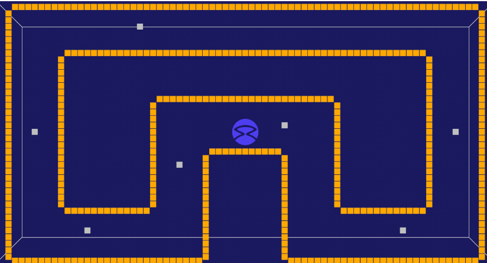

# ASSIGNMENT1
## ABSTRACT

The task of the robot is to detect the gold and the silver tokens.To be specific, the objective of the robot is to pick up the silver token and drop and then move forward to the next one.The sensors present in the robot would have the capability to sense the tokens in all directions.

## INTRODUCTION

The entire process is carried out in a counter-clockwise direction until it reaches the point from where it started, making sure that it doesn't hit the gold wall.Each token is meant to be picked up by the robot and then dropped aside.
Given below is the arena:

## METHODOLOGY

###### 1. DRIVE :-
        
The function is used to give velocity to the robot.The function gives the speed of the wheels and also ensures the time intervals at which the action will take place.

###### 2. TURN :-

The function is used to set up angulatr velocity to the robot.In other words, it is used to turn the robot in the direction of the token.

###### 3. FIND AND GRAB SILVER :-

The function is used to find the silver token and grab it.The robot aligns itself in the direction of the token (if it's not aligned) and then goes near the silver token before grabbing it.

The robot then turns around and releases the silver token.Then it turns back in order to return to it's previous position(the position before taking turn) and goes to the next silver token.

###### 4. FIND AND AVOID GOLD TOKEN :-

The function is used to detect the gold token and avoid it in the due process.The distance and angle of the closest gold token can be found and avoided.

## FLOWCHART

## CONCLUSION AND IMPROVEMENTS 

The complete result can be shown through the simulation as the above-mentioned objectives have been met with the help of above-mentioned functions.
One of the improvisation that could be done is that several sensors can be used in order to provide the robot a correct path.
